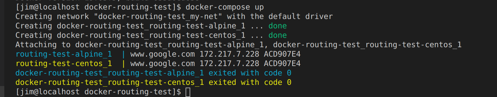

# Docker Routing Test

This is a quick hello-world project for ensuring my docker container can route out of the container and onto the internet.

This is accomplished using `gethostip www.google.com`

The following containers are used:

1. alpine [Dockerfile-alpine](./Dockerfile-alpine)
1. centos [Dockerfile-centos](./Dockerfile-centos)

### Run this...

1. `docker-compose build`
1. `docker-compose up`

### Expected output

Inline-style: 

